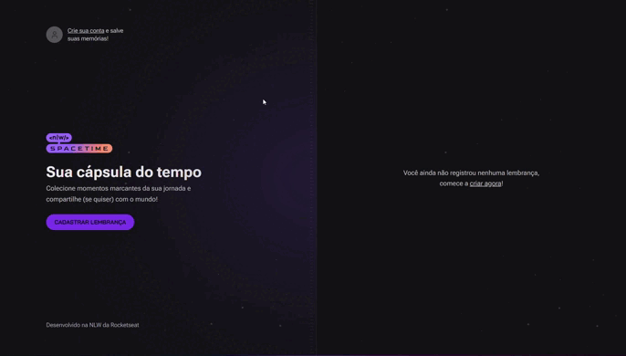

<h1 align="center"> NLW Spacetime </h1>

<p align="center">
Projeto Spacetime Rocketseat<br/>
</p>

<p align="center">
  <a href="#-tecnologias">Tecnologias</a>&nbsp;&nbsp;&nbsp;|&nbsp;&nbsp;&nbsp;
  <a href="#-projeto">Projeto</a>&nbsp;&nbsp;&nbsp;|&nbsp;&nbsp;&nbsp;
  <a href="#-como usar?">Como usar?</a>&nbsp;&nbsp;&nbsp;|&nbsp;&nbsp;&nbsp;
</p>

<p align="center">
  
</p>

<br>

<p align="center">
  
</p>

## 💻 Projeto

Aplicação desenvolvida no evento da Rocketseat, com o objetivo de preservar memórias, oferecendo ao usuário a capacidade de adicionar imagens ou vídeos significativos em uma linha do tempo personalizada.

## 🚀 Tecnologias

Esse projeto foi desenvolvido com as seguintes tecnologias:

- React js
- Next js 
- Typescript
- Tailwindcss
- Axios
- Lucide React
- Node js
- Fastify
- Prima
- Zod
- JWT
- JS cookie

## Como usar?

## Web

#### Instalação das dependências:
```bash
cd web
```

```bash
npm install
```

#### Start:

```bash
npm run dev
```

## Server

#### Instalação das dependências:

```bash
cd server
```

```bash
npm install
```

#### Para criar as tabelas no Prisma

```bash
npx prisma migrate dev
```

#### Start:

```bash
npm run dev
```